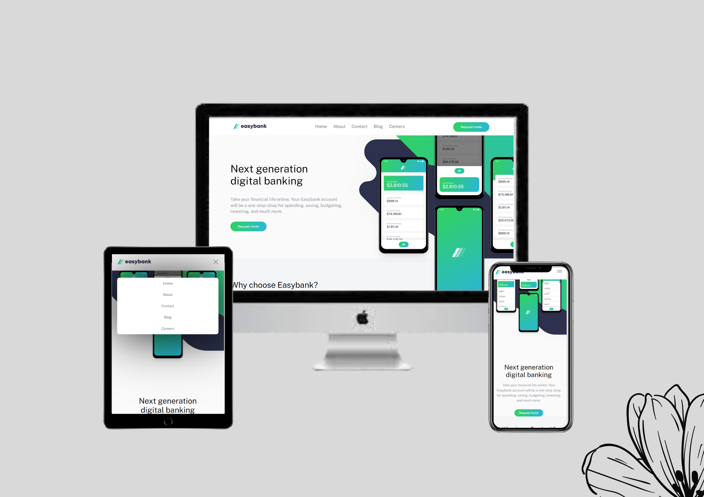

# Frontend Mentor - Easybank landing page solution

This is a solution to the [Easybank landing page challenge on Frontend Mentor](https://www.frontendmentor.io/challenges/easybank-landing-page-WaUhkoDN).

## Table of contents

- [Overview](#overview)
  - [The challenge](#the-challenge)
  - [Screenshot](#screenshot)
  - [Links](#links)
- [My process](#my-process)
  - [Built with](#built-with)
  - [What I learned](#what-i-learned)
- [Author](#author)
- [Acknowledgments](#acknowledgments)

**Note: Delete this note and update the table of contents based on what sections you keep.**

## Overview

### The challenge

Users should be able to:

- View the optimal layout for the site depending on their device's screen size
- See hover states for all interactive elements on the page

### Screenshot




**Note: Delete this note and the paragraphs above when you add your screenshot. If you prefer not to add a screenshot, feel free to remove this entire section.**

### Links

- Solution URL: [Github Repo Link](https://github.com/arsxlanali/Easy-Bank-Landing-Page)
- Live Site URL: [Live URL](http://arsxlanali.tech/Easy-Bank-Landing-Page/)

## My process

### Built with

- Semantic HTML5 markup
- CSS custom properties
- Flexbox


### What I learned

These code snippets are the solution where I stugle finding the solution of problem:

```css
svg {
    fill: white;
}
svg:hover {
    cursor: pointer;
    fill: hsl(136, 65%, 51%);
}
```
```js
function changeImage() 
{
  var x = document.getElementById("navbtn");
  if (x.style.display === "flex") 
  {
    x.style.display = "none";
    document.getElementById("icon").src = "./images/icon-hamburger.svg";
  } 
  else 
  {
    x.style.display = "flex";
    document.getElementById("icon").src = "./images/icon-close.svg";
  }
}
```

## Author

- Website - [Arslan Ali](https://arsxlanali.tech)
- Frontend Mentor - [@arsxlanali](https://www.frontendmentor.io/profile/arsxlanali)
- Twitter - [@arsxlanali](https://www.twitter.com/arsxlanali)

**Note: Delete this note and add/remove/edit lines above based on what links you'd like to share.**

## Acknowledgments

Got stuck when creating the dropdown menu and got help from freeCodeCamp video created by Jessica Chan.

